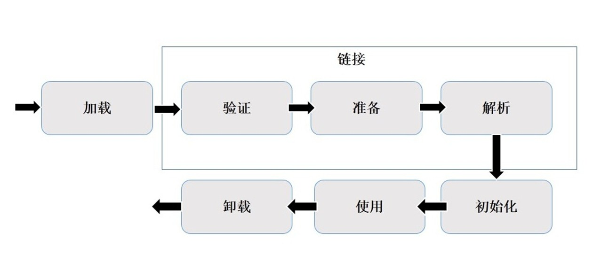

##### classload文件

一个Java应用，都是由若干个.class文件组织而成的一个完整的Java应用程序，当程序在运行时，
即会调用该程序的一个入口函数来调用系统的相关功能，而这些功能都被封装在不同的class文件当中，
所以经常要从这个class文件中要调用另外一个class文件中的方法，
如果另外一个文件不存在的，则会引发系统异常。而程序在启动的时候，并不会一次性加载程序所要用的所有class文件，
而是根据程序的需要，通过Java的类加载机制（ClassLoader）来动态加载某个class文件到内存当中的，
从而只有class文件被载入到了内存之后，才能被其它class所引用。
所以ClassLoader就是用来动态加载class文件到内存当中用的。

##### Java类装载过程

装载：通过类的全限定名获取二进制字节流，将二进制字节流转换成方法区中的运行时数据结构，在内存中生成Java.lang.class对象
链接：执行下面的校验、准备和解析步骤，其中解析步骤是可以选择的
校验：检查导入类或接口的二进制数据的正确性；（文件格式验证，元数据验证，字节码验证，符号引用验证）
准备：给类的静态变量分配并初始化存储空间
解析：将常量池中的符号引用转成直接引用

##### 类加载双亲委派机制
**JVM在加载类时默认采用的是双亲委派机制。**
通俗的讲，就是某个特定的类加载器在接到加载类(.class)的请求时，首先将加载任务委托给父类加载器，
**依次递归 (本质上就是loadClass函数的递归调用)**。因此，
**所有的加载请求最终都应该传送到顶层的启动类加载器中**。
如果父类加载器可以完成这个类加载请求，就成功返回；只有当父类加载器无法完成此加载请求时，
子加载器才会尝试自己去加载。事实上，大多数情况下，越基础的类由越上层的加载器进行加载，
因为这些基础类之所以称为“基础”，是因为它们总是作为被用户代码调用的API（当然，也存在基础类回调用户用户代码的情形）。

##### 系统提供的类加载器

主要有下面三个：

（1）启动类加载器（Bootstrap ClassLoader）--它用来加载 Java 的核心库，是用原生代码来实现的，并不继承自java.lang.ClassLoader；

这个类加载器负责将存放在JAVA_HOME/lib下的，或者被-Xbootclasspath参数所指定的路径中的，并且是被虚拟机识别的类库（仅按照文件名识别，如rt.jar，名字不符合的类库，即使放在指定路径中也不会被加载）加载到虚拟机内存中；启动类加载器无法被Java程序直接引用；

（2）扩展类加载器（Extension ClassLoader）--它用来加载 Java 的扩展库；

这个加载器负责加载JAVA_HOME/lib/ext目录中的，或者被java.ext.dirs系统变量所指定的路径中的所有类库，开发者可以直接使用扩展类加载器；

（3）应用类加载器（Application ClassLoader）--它根据 Java 应用的类路径（CLASSPATH）来加载 Java 类；

Class.forName(className)方法，内部实际调用的方法是  Class.forName(className,true,classloader);

第2个boolean参数表示类是否需要初始化，  Class.forName(className)默认是需要初始化。一旦初始化，就会触发目标对象的 static块代码执行，static参数也也会被再次初始化。

##### Class.forName vs ClassLoader.loadClass 

~~~
Class.forName(className)方法，内部实际调用的方法是  Class.forName(className,true,classloader);

第2个boolean参数表示类是否需要初始化，  Class.forName(className)默认是需要初始化。

一旦初始化，就会触发目标对象的 static块代码执行，static参数也也会被再次初始化。
Class.forName("com.mysql.jdbc.Driver");//加载及注册JDBC驱动程序，这里使用桥接模式。

ClassLoader.loadClass(className)方法，内部实际调用的方法是  ClassLoader.loadClass(className,false);

第2个 boolean参数，表示目标对象是否进行链接，false表示不进行链接，由上面介绍可以，
不进行链接意味着不进行包括初始化等一些列步骤，那么静态块和静态对象就不会得到执行
~~~

